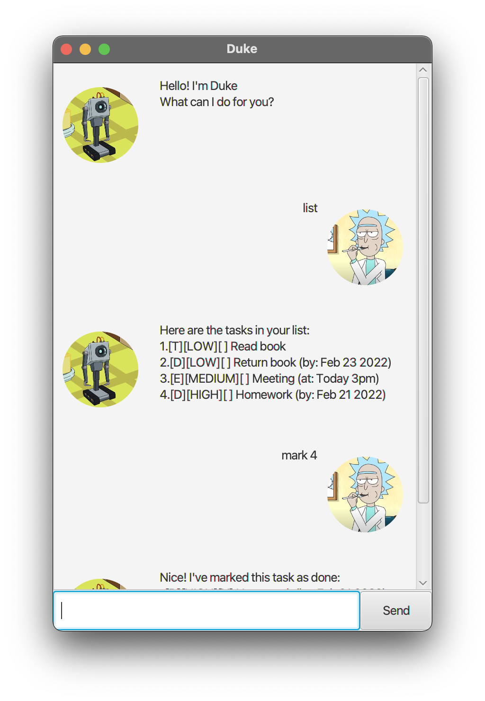

# User Guide
Duke is a desktop chatbot for task management.

## Quick Start
1. Ensure that Java `11` or above is installed on your computer.
2. Download the latest `duke.jar` from [here](https://github.com/chuabingquan/ip/releases/tag/A-Release).
3. Copy the file to a folder that you want to use as the home folder for Duke.
4. Double-click the file to start using the chatbot.
5. Type the command in the input field and press `Enter` to execute it. Here are some commands to get started:
    - `list`: List all your tasks.
    - `todo Read book`: Adds a `Read book` todo item to your task list.
    - `mark 1`: Marks the first task as completed.
    - `medium 1`: Changes the priority of the first task to __MEDIUM__.
    - `delete 1`: Removes the first task from your task list.
    - `bye`: Exits the chatbot.
6. Refer to [features](#features) for more commands.

## Features 

| Command                          | Description                                                                          | Arguments                                                                     |
|----------------------------------|--------------------------------------------------------------------------------------|-------------------------------------------------------------------------------|
| `list`                           | Lists the tasks from the task list.                                                  | None.                                                                         |
| `todo DESCRIPTION`               | Adds a todo item with the given description to the task list.                        | `DESCRIPTION`: A text value.                                                  |
| `deadline DESCRIPTION /by DATE`  | Adds a deadline item with the given description and due date to the task list.       | `DESCRIPTION`: A text value.   `DATE`: A date formatted in `yyyy-MM-dd`. |
| `event DESCRIPTION /at DURATION` | Adds an event item with the given description and duration to the task list.         | `DESCRIPTION`: A text value.   `DURATION`: A text value.                 |
| `mark INDEX`                     | Marks the task with the given index in the task list as completed.                   | `INDEX`: A positive integer.                                                  |
| `unmark INDEX`                   | Marks the task with the given index in the task list as uncompleted.                 | `INDEX`: A positive integer.                                                  |
| `delete INDEX`                   | Removes the task with the given index from the task list.                            | `INDEX`: A positive integer.                                                  |
| `low INDEX`                      | Change the priority of the task with the given index in the task list to __LOW__.    | `INDEX`: A positive integer.                                                  |
| `medium INDEX`                   | Change the priority of the task with the given index in the task list to __MEDIUM__. | `INDEX`: A positive integer.                                                  |
| `high INDEX`                     | Change the priority of the task with the given index in the task list to __HIGH__.   | `INDEX`: A positive integer.                                                  |
| `bye`                            | Exits the chatbot.                                                                   | None.                                                                         |

## Acknowledgements
- Third party libraries: [JavaFX](https://openjfx.io/), [JUnit](https://junit.org/)
- User guide inspiration: [Address Book - Level 3](https://github.com/se-edu/addressbook-level3)

